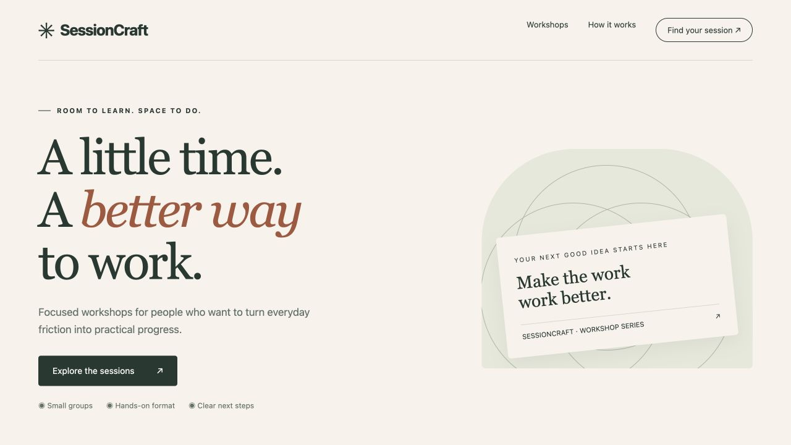
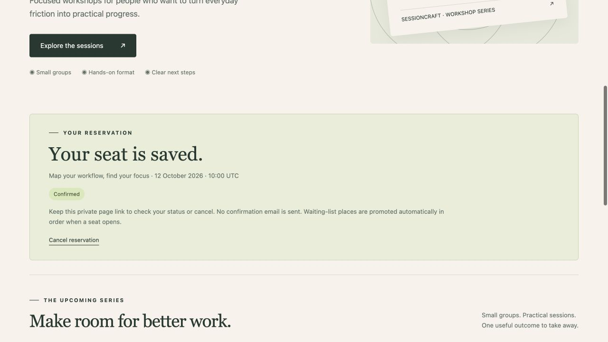

# SessionCraft — Workshop Booking & Capacity Management

A custom WordPress theme and booking plugin connect a responsive workshop catalogue to transactional capacity checks, ordered waiting lists, private cancellation links and staff schedule management.

## What it does

- Concurrent reservations with a locked capacity check
- Ordered waiting list with automatic promotion
- Private token-protected status and cancellation
- WordPress staff schedule and reservation management

## Screenshots

Actual running application, captured with labelled synthetic test data.

Actual WordPress workshop landing page with the SessionCraft identity, clear service message and a route to the session catalogue.

Actual persisted reservation confirmation with a private self-service cancellation link.

## Quick start

Requirements: Docker Desktop running, Python 3, and internet access for the initial official container-image download if it is not cached. No API key or external application account is required.

1. Open **Start WordPress.command** in this folder (or run `python3 wordpress_setup.py` from this folder).
2. Wait for the initialization message.
3. Open **http://127.0.0.1:8195**.

The launcher generates fresh database and login passwords in `.local.env` with owner-only permissions. It initializes WordPress and the original sample programme once. Subsequent launches reuse the same database and WordPress volumes. It does not replace existing bookings, clients or projects.

Staff login: **portfolio_admin**, with the password from `WP_ADMIN_PASSWORD` in `.local.env`. WordPress administration: `http://127.0.0.1:8195/wp-admin/`.

Do not share `.local.env`. It is excluded from source control and installable ZIPs. Keep it with your local installation: the project name in it identifies the persistent Docker volumes. Do not delete it when stopping the project.

## Stop and resume

Open **Stop WordPress.command**, or run `docker compose --env-file .local.env stop`. This keeps data. Open the start command to resume. The service binds only to your computer's loopback address, not your public network interface.

## Editable WordPress source and installable packages

- `wordpress/sessioncraft/`: custom responsive theme.
- `wordpress/sessioncraft-booking/`: application plugin and database tables.
- `sessioncraft.zip`: installable WordPress theme.
- `sessioncraft-booking.zip`: installable WordPress plugin.
- `wordpress/bootstrap.php`: local setup and original sample content.
- `compose.yaml`: official image digests, storage and local-only port mapping.
- `test_wordpress.py`: live integration tests against the local WordPress application.
- `TEST_RESULTS.md`: recorded verification results.
- `CASE_STUDY.md`, `screenshots/`: portfolio material.

To install in another WordPress environment, install and activate the plugin ZIP, then install and activate the theme ZIP. Plugin activation creates its tables. The local bootstrap is specific to the supplied Docker environment and should not be run on a client installation. Create your own content through the application after installation.

## Verification

Run `python3 test_wordpress.py` while the local application is running. It signs in with the generated local credentials, creates clearly named temporary fixtures, and deletes them at the end. Tests rely on the original sample workspace remaining available. See `TEST_RESULTS.md` for the recorded run and scope.

## Boundaries

Locally verified independent project with an original fictional workshop programme. No payments, email notifications, public hosting or real client outcome claims. Schedule times are UTC; reservation details are stored locally.

A public deployment would require your own hostname, HTTPS, maintained WordPress hosting, backups, retention choices, monitoring and an appropriate authentication/abuse-control setup. Public deployment has not been performed or verified here. 

## Use the booking workflow

1. Choose a workshop and open **Reserve your seat**.
2. Enter a name and email address and agree to storage for the reservation.
3. Submit. The result is **confirmed** while seats remain, otherwise **waitlisted**.
4. Save the full private confirmation link. It is the only self-service way to check status or cancel; no email is sent.
5. Cancelling a confirmed booking promotes the earliest waiting reservation automatically. Waiting participants check their saved links to see the change.

The generated cancellation key is stored as a SHA-256 hash in the database. Anyone holding the private link can manage that reservation, so treat it as private. Reservation pages send no-store and no-referrer headers.

Open **SessionCraft** in the WordPress admin menu to add/edit workshops, review booking lists, adjust capacity or permanently delete a workshop and its stored reservations. Capacity increases automatically fill new seats from the waiting list. Reductions below the confirmed booking count are rejected. Dates and times are displayed in UTC.

The default workshops are dated relative to first installation, so they start in the future. After those dates pass, staff can edit their schedules. Workshop deletion permanently removes its reservations; routine stopping does not remove data.

## Implementation details

Custom InnoDB tables store workshops and reservations. Booking and cancellation transactions lock the workshop row before counting seats or changing the queue. A unique workshop/email key prevents duplicates. Native WordPress nonces protect form actions; `manage_options` protects staff schedule changes. Names and descriptions are escaped on display. Cancellation requires both a nonce and a matching secret token. No JavaScript or external fonts are needed for the core booking flow.

## Project documentation

- [Case study](CASE_STUDY.md)
- [Recorded verification](TEST_RESULTS.md)
- [Portfolio PDF](PORTFOLIO.pdf)
- [Screenshot captions](screenshots/CAPTIONS.md)

## License

[MIT](LICENSE) © 2026 Ismail Habib.

The original theme, plugin and project source are MIT licensed. WordPress, MariaDB and their dependencies retain their respective licenses and are fetched separately by Docker; their source is not bundled in the theme or plugin ZIPs.
